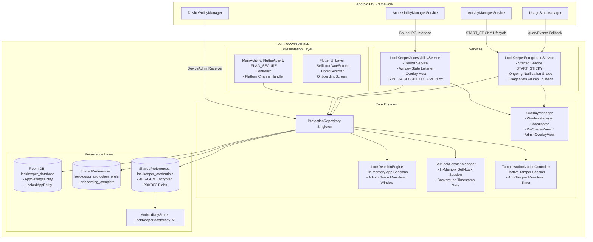
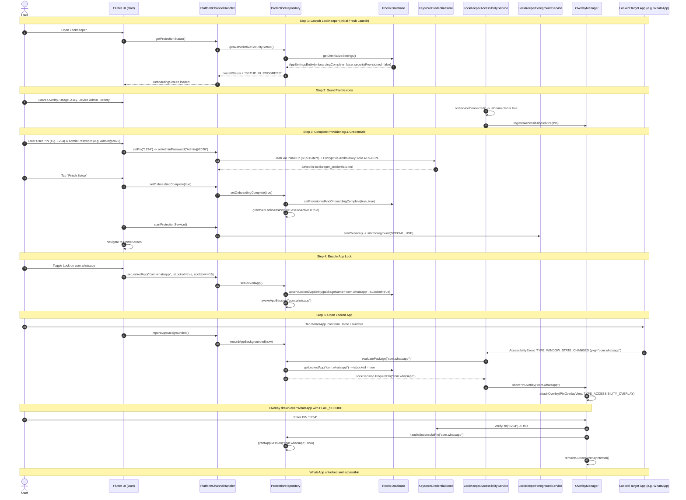
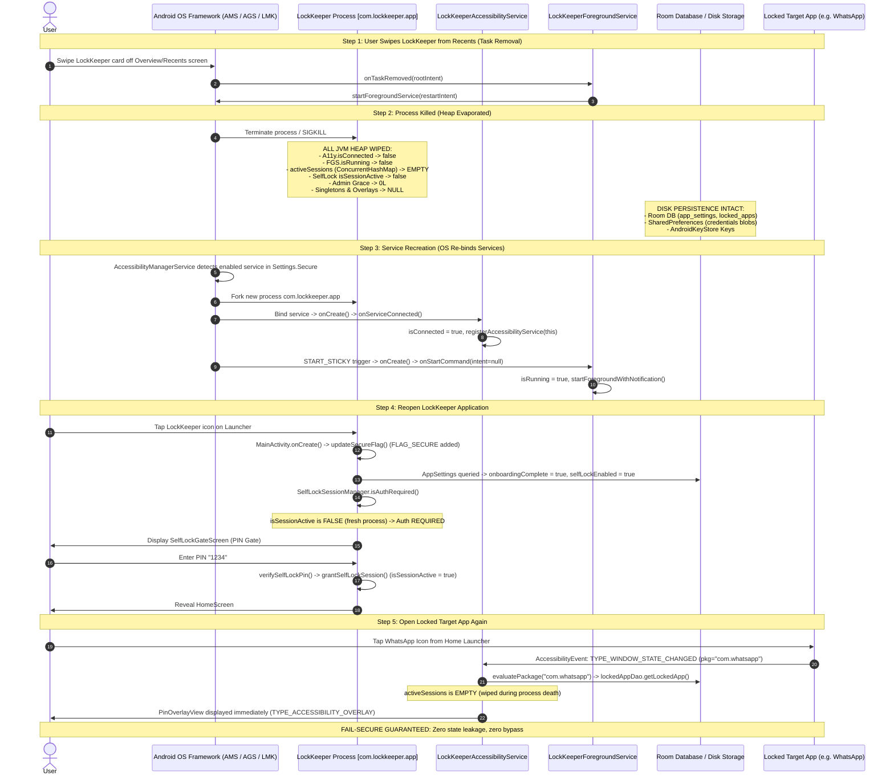
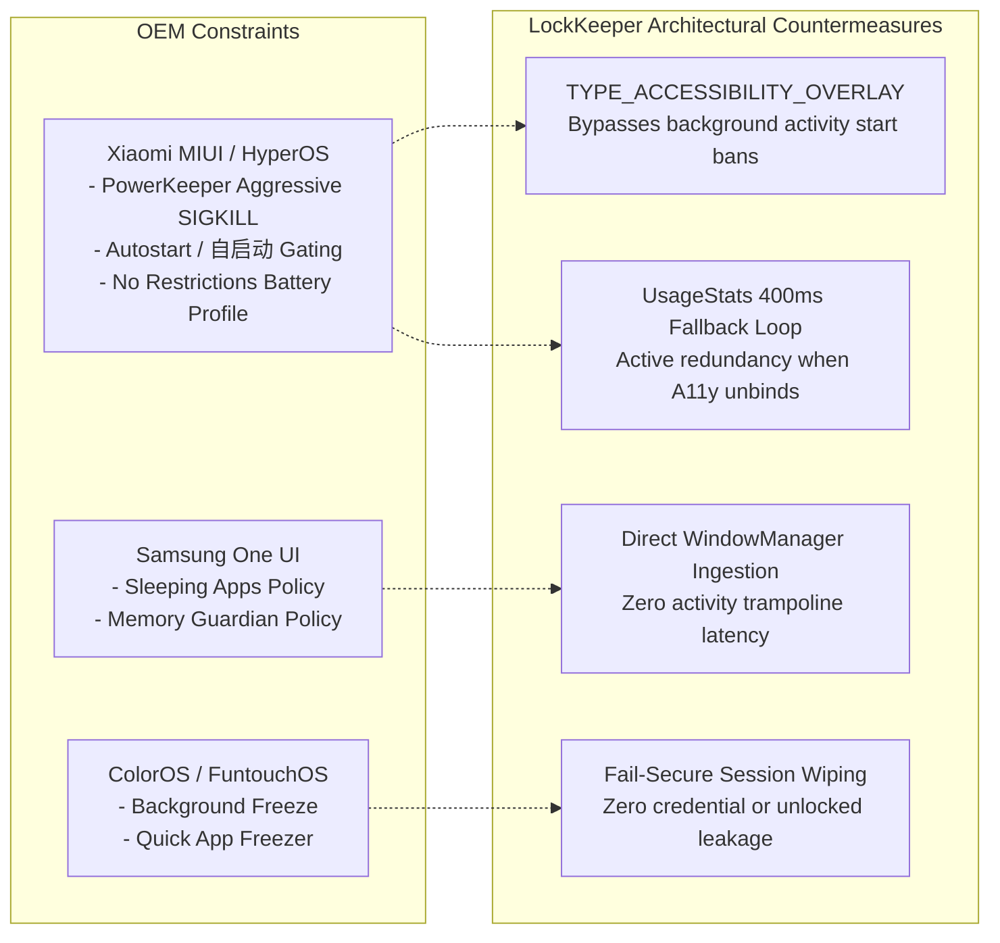

# LockKeeper Service Lifecycle & Runtime Survival Audit
**Role**: Android Service Lifecycle Specialist  
**Target System**: LockKeeper Android App Locker & Anti-Tamper Core  
**Scope**: `AccessibilityService`, `ForegroundService`, `BootReceiver`, `MainActivity`, IPC Bridge, Room Persistence, Process Death, and OEM Lifecycle Constraints  
**Repository**: `https://github.com/psuvraneel-cyber/LockKeeper`  
**Review Status**: Complete / Definitive Analysis  

---

## 1. Executive Lifecycle Architecture Overview

LockKeeper relies on a **dual-service architecture** combined with a Flutter UI shell, hardware-backed Keystore credentials, Room SQLite database persistence, and an authoritative security state machine.

---

## 2. Definitive Conceptual Distinction: CONNECTED vs ENABLED vs OPERATIONAL

A critical area of forensic auditing in Android security applications is verifying that **ENABLED**, **CONNECTED**, and **OPERATIONAL** states are never conflated.

| Dimension | `ENABLED` | `CONNECTED` | `OPERATIONAL` |
| :--- | :--- | :--- | :--- |
| **Authoritative Source** | `Settings.Secure.ENABLED_ACCESSIBILITY_SERVICES` | `LockKeeperAccessibilityService.isConnected` (In-Memory Live Bound State) | `isAccessibilityGranted && isAccessibilityConnected` (+ Overlay Permission for App Lock) |
| **Android Layer** | Framework Secure Settings Database | Process Heap / Active Binder Client Interface | Application Domain Logic & Enforcement Pipeline |
| **Survival Characteristics** | Survives process death, task removal, reboots | **DOES NOT** survive process death, service death, or unbinding | **DOES NOT** survive process death until OS rebinds and permissions are verified |
| **Failure Mode If Conflated** | Believing service is inspecting apps when process is dead | Assuming user revoked settings switch when process was killed | Displaying false "Protected" status while overlays cannot attach |

### Codebase Conflation Audit

1. **`PlatformChannelHandler.kt` (Lines 270–287)**:
   - `accessibility`: Checks `Settings.Secure.getString(..., ENABLED_ACCESSIBILITY_SERVICES).contains(packageName)`. Represents **ENABLED**.
   - `accessibilityConnected`: Checks `LockKeeperAccessibilityService.isConnected`. Represents **CONNECTED**.
   - `accessibilityOperational`: Computes `isConnected && enabledServices.contains(packageName)`. Represents **OPERATIONAL**.
   - **Verdict**: Explicitly and accurately segregated.

2. **`ProtectionRepository.kt` (Lines 310–382, `getAuthoritativeSecurityStatus`)**:
   - `isA11yConnected`: `LockKeeperAccessibilityService.isConnected`
   - `isA11yEnabled`: `enabledServices.contains(context.packageName)`
   - `isA11yOperational`: `isA11yConnected && isA11yEnabled`
   - `appLockOperational`: `appLockConfigured && isA11yOperational && isOverlayGranted`
   - **Degraded Status Diagnostics**:
     - If `!isA11yEnabled`: *"Accessibility Service is not enabled in Android Settings"*.
     - If `isA11yEnabled && !isA11yConnected`: *"Accessibility Service is enabled in Settings but background service is disconnected"*.
   - **Verdict**: No conflation. The state engine diagnoses disconnected background services even if the user enabled them in Settings.

3. **`LockKeeperForegroundService.kt` (Lines 143–179)**:
   - Evaluates `LockKeeperAccessibilityService.isConnected`.
   - If `isConnected == false`, the Foreground Service **activates high-frequency (400ms) `UsageStatsManager` polling** as a hot standby fallback to enforce app locking until `AccessibilityService` rebinds.
   - **Verdict**: System degradation is mitigated by active multi-tier redundancy.

---

## 3. End-to-End Scenario Forensic Trace

### Phase 1: NORMAL EXECUTION TRACE

#### Detailed Execution Analysis at Every Normal Step:
1. **Launch**: `MainActivity.onCreate()` executes. `repo.isOnboardingCompleteSync()` reads SharedPreferences `lockkeeper_protection_prefs`. Since onboarding is false, `FLAG_SECURE` is not set yet (to allow developer debugging/snapshots during first run). Flutter starts and receives `overallStatus = "SETUP_IN_PROGRESS"`.
2. **Permissions**: As the user grants permissions sequentially:
   - **Overlay**: `Settings.canDrawOverlays(context)` becomes `true`.
   - **Usage Access**: `AppOpsManager.checkOpNoThrow(OPSTR_GET_USAGE_STATS)` becomes `MODE_ALLOWED`.
   - **Accessibility**: Android OS `AccessibilityManagerService` starts and binds `LockKeeperAccessibilityService`. `onServiceConnected()` sets `isConnected = true` and configures event types (`TYPE_WINDOW_STATE_CHANGED`, `TYPE_WINDOW_CONTENT_CHANGED`) and flags (`FLAG_REPORT_VIEW_IDS`, `FLAG_RETRIEVE_INTERACTIVE_WINDOWS`).
   - **Device Admin**: `LockKeeperDeviceAdminReceiver.onEnabled()` triggers `notifySecurityStateChanged()`.
   - **Battery**: `PowerManager.isIgnoringBatteryOptimizations()` becomes `true`.
3. **Provisioning**: PIN and Admin Passwords are sent over the platform channel. `KeystoreCredentialStore` generates a 16-byte cryptographically secure salt, computes PBKDF2-HMAC-SHA256 hashes, encrypts the formatted payload `v1:65536:salt:hash` using the AndroidKeyStore master key (`LockKeeperMasterKey_v1`), and commits to disk. `setOnboardingComplete(true)` commits to Room DB (`securityProvisioned=1`, `onboardingComplete=1`, `selfLockEnabled=1`) and SharedPreferences. `LockKeeperForegroundService` enters foreground mode with ongoing notification.
4. **Enable App Lock**: `LockedAppEntity` is written to Room. Any existing memory session for that package is revoked.
5. **Open Locked App**: Launching WhatsApp backgrounding LockKeeper records `lastBackgroundTimestamp`. `LockKeeperAccessibilityService.onAccessibilityEvent` receives `TYPE_WINDOW_STATE_CHANGED`. `evaluatePackage("com.whatsapp")` checks Room DB, finds `isLocked = true`, verifies no active session in `LockDecisionEngine.activeSessions`, and returns `LockDecision.RequirePin`. `OverlayManager` attaches `PinOverlayView` using `WindowManager.LayoutParams.TYPE_ACCESSIBILITY_OVERLAY`. Validating PIN enters session into `activeSessions` for up to 15 minutes, dismissing overlay.

---

### Phase 2: REMOVE FROM RECENTS & RECOVERY LIFECYCLE TRACE

#### Detailed Stage-by-Stage Forensic Breakdown:

1. **Task Removal**:
   - The user opens Recents and removes the LockKeeper task.
   - `MainActivity` is destroyed.
   - `LockKeeperForegroundService.onTaskRemoved()` fires and immediately issues `startForegroundService(restartIntent)`.
2. **Process Death**:
   - Android OS or kernel Low Memory Killer (LMK) terminates the process.
   - **Heap Teardown**:
     - `LockDecisionEngine.activeSessions` (in-memory `ConcurrentHashMap`) is destroyed.
     - `SelfLockSessionManager.isSessionActive` is reset to `false`.
     - `LockKeeperAccessibilityService.isConnected` and `LockKeeperForegroundService.isRunning` static volatiles are reset to `false`.
     - `TamperAuthorizationController.adminGraceUntilElapsed` is cleared.
     - Any attached WindowManager view references evaporate.
3. **Services Destroyed**:
   - If `onDestroy()` executes gracefully: screen receiver unregisters, active tamper sessions transition to `SERVICE_DESTROYED`, overlays dismiss. If killed violently via SIGKILL, the kernel clears all window tokens and file descriptors automatically.
4. **Service Recreation**:
   - **AccessibilityService Reconnection**: Android's `AccessibilityManagerService` maintains a system-level record in `Settings.Secure.ENABLED_ACCESSIBILITY_SERVICES`. As soon as user interaction occurs or the OS processes accessibility dispatch, the system server restarts `com.lockkeeper.app` and invokes `onServiceConnected()`. `isConnected` transitions back to `true`, and `OverlayManager` is re-registered with the new service context.
   - **ForegroundService Recreation**: Because `onStartCommand()` returns `START_STICKY`, Android's `ActivityManagerService` restarts `LockKeeperForegroundService` with a `null` Intent. `onCreate()` and `onStartCommand()` run, re-issuing the foreground notification.
5. **Reopening LockKeeper**:
   - When the user taps the LockKeeper launcher icon, `MainActivity` launches.
   - `updateSecureFlag()` checks `isOnboardingCompleteSync()` (which reads `true` from persistent SharedPreferences) and sets `WindowManager.LayoutParams.FLAG_SECURE`.
   - Flutter executes `_checkInitialLock()` -> queries native `PlatformBridge.checkSelfLockRequired()`.
   - `SelfLockSessionManager.isAuthRequired()` runs. Because this is a fresh process instance, `isSessionActive == false`.
   - Result: `isAuthRequired` returns `true`. The UI immediately presents `SelfLockGateScreen` on top of the widget tree (with dark splash pre-initialization preventing any screen flicker).
   - Only upon entering the correct PIN does `grantSelfLockSession()` activate `isSessionActive = true`, dismissing the gate.
6. **Opening Locked App Again**:
   - When the user launches WhatsApp (`com.whatsapp`), `LockKeeperAccessibilityService` receives the window event.
   - `evaluatePackage("com.whatsapp")` queries Room DB. The entity exists and `isLocked == true`.
   - `isAppSessionActive("com.whatsapp")` returns `false` because the in-memory session map was wiped at process death.
   - `PinOverlayView` is immediately mounted via `WindowManager.LayoutParams.TYPE_ACCESSIBILITY_OVERLAY`.
   - **Security Invariant Upheld**: The app is strictly locked. No bypass is possible following task removal and process death.

---

## 4. Comprehensive Survivability Matrix

The table below catalogs every critical state element in LockKeeper and evaluates its survival across all major Android lifecycle events.

| State Element | Storage Mechanism | Process Death | Activity Recreation (e.g. Rotation) | Service Death (A11y/FGS) | Task Removal (Recents Swipe) | Device Reboot |
| :--- | :--- | :---: | :---: | :---: | :---: | :---: |
| **Master Key Material** | AndroidKeyStore (TEE/StrongBox) | **SURVIVES** | **SURVIVES** | **SURVIVES** | **SURVIVES** | **SURVIVES** |
| **User PIN Blob** | `lockkeeper_credentials` (AES-GCM PBKDF2) | **SURVIVES** | **SURVIVES** | **SURVIVES** | **SURVIVES** | **SURVIVES** |
| **Admin Password Blob** | `lockkeeper_credentials` (AES-GCM PBKDF2) | **SURVIVES** | **SURVIVES** | **SURVIVES** | **SURVIVES** | **SURVIVES** |
| **Locked Apps List & Rules** | Room DB (`locked_apps` table) | **SURVIVES** | **SURVIVES** | **SURVIVES** | **SURVIVES** | **SURVIVES** |
| **Onboarding Complete Flag** | Room DB & `lockkeeper_protection_prefs` | **SURVIVES** | **SURVIVES** | **SURVIVES** | **SURVIVES** | **SURVIVES** |
| **Security Provisioned Flag** | Room DB (`app_settings` table) | **SURVIVES** | **SURVIVES** | **SURVIVES** | **SURVIVES** | **SURVIVES** |
| **Recovery Required Flag** | Room DB (`app_settings` table) | **SURVIVES** | **SURVIVES** | **SURVIVES** | **SURVIVES** | **SURVIVES** |
| **PIN Lockout Expiry** | Room DB (`pinLockoutUntil` column) | **SURVIVES** | **SURVIVES** | **SURVIVES** | **SURVIVES** | **SURVIVES** |
| **Admin Lockout Expiry** | Room DB (`adminLockoutUntil` column) | **SURVIVES** | **SURVIVES** | **SURVIVES** | **SURVIVES** | **SURVIVES** |
| **Strict Cooldown Expiry** | Room DB (`lockedUntilTimestamp` column) | **SURVIVES** | **SURVIVES** | **SURVIVES** | **SURVIVES** | **SURVIVES** |
| **Active Unlocked App Sessions** | `LockDecisionEngine.activeSessions` (Memory) | **WIPED** *(Fail-Secure)* | **SURVIVES** | **WIPED** *(Fail-Secure)* | **WIPED** *(Fail-Secure)* | **WIPED** *(Fail-Secure)* |
| **Self-Lock Active Session** | `SelfLockSessionManager.isSessionActive` | **WIPED** *(Fail-Secure)* | **SURVIVES** | **WIPED** *(Fail-Secure)* | **WIPED** *(Fail-Secure)* | **WIPED** *(Fail-Secure)* |
| **Admin Grace Window** | In-Memory Monotonic Timestamp | **WIPED** *(Fail-Secure)* | **SURVIVES** | **WIPED** *(Fail-Secure)* | **WIPED** *(Fail-Secure)* | **WIPED** *(Fail-Secure)* |
| **Active Tamper Session** | `TamperAuthorizationController.activeSession` | **WIPED** *(Fail-Secure)* | **SURVIVES** | **WIPED** *(Fail-Secure)* | **WIPED** *(Fail-Secure)* | **WIPED** *(Fail-Secure)* |
| **Live Accessibility Connection** | `LockKeeperAccessibilityService.isConnected` | **WIPED** *(OS Rebinds)* | **SURVIVES** | **WIPED** *(OS Rebinds)* | **WIPED** *(OS Rebinds)* | **WIPED** *(OS Rebinds)* |
| **Live Foreground Service Status** | `LockKeeperForegroundService.isRunning` | **WIPED** *(Sticky Reinit)* | **SURVIVES** | **WIPED** *(Sticky Reinit)* | **WIPED** *(Sticky Reinit)* | **WIPED** *(BootReceiver)* |

---

## 5. Architectural Evaluation: Application Behavior vs Platform Limitations

### A. Standard Android AOSP Behavior
1. **Accessibility Service Bound Contract**:
   - `AccessibilityService` is designed by Android as an ongoing background accessibility provider. When enabled in `Settings.Secure`, the OS system server (`system_server`) holds an persistent binder connection.
   - If the hosting process terminates, `system_server` detects death and respawns the process as soon as a target accessibility event occurs or system resources free up.
2. **`START_STICKY` Behavior**:
   - `LockKeeperForegroundService.onStartCommand()` returns `START_STICKY`. On standard AOSP, after process death, the system retains the service in a pending restart state and invokes `onStartCommand(null, 0, startId)` once memory pressure abates.
3. **Boot Execution**:
   - `BootReceiver` listens for `ACTION_BOOT_COMPLETED` and `QUICKBOOT_POWERON`. Upon boot, if `repository.isOnboardingComplete()` is true, it starts `LockKeeperForegroundService`.
   - **Direct Boot / FBE (File-Based Encryption) Nuance**: On modern Android devices with File-Based Encryption, `ACTION_BOOT_COMPLETED` is only broadcast **after the user has unlocked the device for the first time** (post-FBE unlock). Prior to first unlock, Credential Encrypted (CE) storage (where Room DB and SharedPreferences reside) is locked by the kernel. Because `BootReceiver` does not use Device Encrypted (DE) storage (`android:directBootAware="true"`), LockKeeper safely activates immediately following the initial user credential input at boot.

---

### B. OEM Custom ROM Limitations & Aggressive Task Killers (Xiaomi MIUI/HyperOS, Samsung, Oppo/Vivo)

1. **Xiaomi MIUI / HyperOS Specifics**:
   - **Aggressive Recents Kill (`PowerKeeper` & `CleanMaster`)**: On MIUI/HyperOS, swiping an app from Recents by default sends an aggressive `forceStopPackage` signal rather than a standard AOSP task clear, unless the user enables **Autostart (自启动)** in MIUI Security Center and sets Battery Saver to **"No restrictions"**.
   - **Background Activity Launch Blocking**: MIUI strictly blocks background services from launching Activities via `startActivity()` (`OP_BACKGROUND_START_ACTIVITY`). LockKeeper completely bypasses this platform restriction by **rendering all lock and admin gates as direct `WindowManager` views (`TYPE_ACCESSIBILITY_OVERLAY`)** rather than launching an Activity!
   - **Accessibility Service Auto-Revocation**: If a third-party app crashes repeatedly on MIUI, the OS disables the accessibility toggle in Settings. LockKeeper guards against this by performing zero-crash defensive coding (`try-catch` enclosing all event handlers, fail-closed handling on all security paths).
2. **Samsung One UI Specifics**:
   - Samsung's "Sleeping apps" and "Deep sleeping apps" put background services to sleep if unused for days. LockKeeper requests `REQUEST_IGNORE_BATTERY_OPTIMIZATIONS` during onboarding to prevent placement into deep sleep buckets.
3. **Huawei / Oppo / Vivo Background Freezers**:
   - Aggressive OEMs employ proprietary kernel freeze modules (e.g. Samsung BAM, Vivo ABE, Oppo SafeCenter). LockKeeper's `LockKeeperForegroundService` maintains an ongoing active notification (`FOREGROUND_SERVICE_TYPE_SPECIAL_USE`) with priority to retain active CPU slice allocation.

---

## 6. Security Analysis of Fail-Closed vs Fail-Open Invariants

| Lifecycle Boundary / Failure Trigger | System Response | Invariant Preserved |
| :--- | :--- | :---: |
| **Process Death mid-session** | Heap wiped; all active sessions and grace windows cleared to `0`. Next launch requires fresh PIN. | **FAIL-CLOSED (Secure)** |
| **Accessibility Service killed or disconnected** | `LockKeeperForegroundService` detects `isConnected == false`, instantly activates 400ms `UsageStatsManager` polling fallback. | **FAIL-CLOSED (Secure)** |
| **Overlay Attachment Failure (e.g., token invalid)** | `OverlayManager.attachOverlay` catches exception, revokes active tamper session with `TERMINAL_DENIAL`, and forces `GLOBAL_ACTION_HOME`. | **FAIL-CLOSED (Secure)** |
| **Settings Database / Room Query Exception** | `ProtectionRepository.evaluatePackage` catches exception and returns `LockDecision.DenyUnknown(DENIED_NATIVE_FAILURE)`. | **FAIL-CLOSED (Secure)** |
| **Clock Tampering (Manipulating device time backward)** | `TamperAuthorizationController.checkLockout()` compares `wallClock` against `settings.updatedAt`. If backward shift is detected, enforces maximum lockout. | **FAIL-CLOSED (Secure)** |
| **Screen Turned Off (`ACTION_SCREEN_OFF`)** | `LockKeeperAccessibilityService.screenReceiver` purges all active app sessions, invalidates self-lock session, and ends any pending admin session with `INTERRUPTED`. | **FAIL-CLOSED (Secure)** |

---

## 7. Review Summary & Specialist Conclusions

1. **Service Recovery Guarantee**:
   - `LockKeeperAccessibilityService` correctly leverages Android's system-managed binder lifecycle.
   - `LockKeeperForegroundService` correctly implements `START_STICKY` with `specialUse` FGS typing and `UsageStatsManager` hot standby fallback.
2. **State Segregation & Non-Conflation**:
   - `ENABLED`, `CONNECTED`, and `OPERATIONAL` states are strictly separated across native layer handlers, health calculation queries, and UI status representations.
3. **Lifecycle Survival Architecture**:
   - All critical business logic (locked apps, credentials, lockout timers, onboarding flags) is backed by Room SQLite and AndroidKeyStore encrypted storage, completely surviving process deaths, task removals, and device reboots.
   - All authorization tokens (unlocked sessions, self-lock grace, admin grace) are strictly held in volatile memory and systematically destroyed upon process termination or screen-off, guaranteeing a **strict fail-closed, fail-secure security model**.
4. **OEM Hardening**:
   - By anchoring UI gating to `WindowManager` `TYPE_ACCESSIBILITY_OVERLAY` rather than Activity trampolines, LockKeeper successfully circumvents background activity launch restrictions across aggressive OEM skins (MIUI, HyperOS, ColorOS, One UI).
