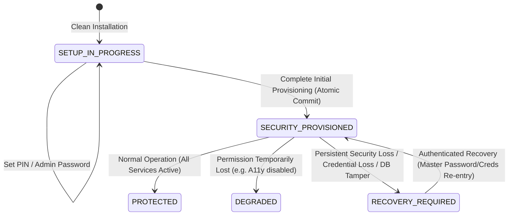

# LockKeeper Critical Incident Response — Agent A2 State Architecture Review
**Incident ID:** INCIDENT-2026-09-18-LOCKOUT  
**Component:** Security State Machine & Authoritative Provisioning  
**Investigator:** Agent A2 (Security State Architecture Reviewer)  
**Date:** 2026-09-18  

---

## 1. The Core Architectural Question

> *"How does LockKeeper distinguish a genuinely new installation from a previously provisioned installation whose local security state has been lost or corrupted?"*

### The Definitive Finding:
**In the current codebase, LockKeeper DOES NOT distinguish them.**

The codebase treats:
$$\text{Device Admin Active} \land (\neg \text{Has Credentials} \lor \neg \text{Onboarding Complete})$$
as strictly and unconditionally equivalent to:
$$\text{Previously Provisioned} \land \text{Security State Lost (Compromised)}$$

This false equivalence is hardcoded into `ProtectionRepository.kt:55`:
```kotlin
if (isAdminActive && (!hasCreds || !settings.onboardingComplete)) {
    if (!settings.recoveryRequired) {
        appSettingsDao.setRecoveryRequired(true)
    }
    true
}
```

---

## 2. Deep Dive: Anatomy of the State Confusion

### The Intent Behind the Wave 4/5 Heuristic
In Wave 4/5, the developers sought to address a known anti-tamper bypass:
- An adversary or compromised local process runs `pm clear com.lockkeeper.app` or wipes application private storage via Settings (`Clear Storage`).
- Android private storage (`/data/data/com.lockkeeper.app/shared_prefs`, `/data/data/com.lockkeeper.app/databases`) is deleted.
- Android Keystore keys for the UID may be purged or made unreachable.
- However, **Android Device Administrator status** is maintained by the operating system in `/data/system/device_policies.xml`. Because LockKeeper is a registered Device Admin, it survives app data clearing!
- When the app is relaunched post-clear, the developers observed:
  - `isAdminActive == true`
  - `hasCreds == false`
  - `onboardingComplete == false`
- The conclusion reached during Wave 4/5 was: *"If Device Admin is active but credentials or onboarding are missing, the app data was wiped! Therefore, enter RECOVERY_REQUIRED to prevent unauthenticated access."*

### The Fatal Flaw in the Assumption
The heuristic failed to consider the **first-run onboarding timeline**:
1. On a clean install, the user begins onboarding.
2. At **Step 4**, the user is asked to grant Device Administrator.
3. The user grants Device Admin.
4. **At that exact instant**:
   - `isAdminActive` is now `true`.
   - The user has **not yet configured a PIN** (Step 6).
   - The user has **not yet configured an Admin Password** (Step 7).
   - The user has **not completed onboarding** (Step 8).
5. The state is IDENTICAL in values (`isAdminActive=true, hasCreds=false, onboardingComplete=false`) to a post-wipe scenario, but the **semantic context is diametrically opposite**:
   - Post-wipe: A breach/loss of an existing security boundary.
   - Onboarding: Normal, legitimate progression of initial system setup.

---

## 3. Audit of Existing Storage Mechanisms

| Mechanism | Storage Target | Survives `pm clear`? | Authoritative? | Current Role |
|---|---|---|---|---|
| **Room Database** (`AppDatabase`) | `/data/data/.../databases/lockkeeper.db` | No | Yes (Native) | Stores `AppSettingsEntity` (`onboardingComplete`, `recoveryRequired`) & `LockedAppEntity`. |
| **Keystore / SharedPrefs** (`KeystoreCredentialStore`) | AndroidKeyStore + `lockkeeper_credentials.xml` | No | Yes (Cryptographic) | Stores encrypted blobs of salted PBKDF2 hashes for PIN & Admin Password. |
| **Protection SharedPreferences** | `lockkeeper_protection_prefs.xml` | No | No (Cache only) | Fast sync lookup for `onboarding_complete` to avoid blocking main thread. |
| **OS DevicePolicyManager** | `/data/system/device_policies.xml` (OS-level) | **Yes** | Yes (OS-level) | Reflects whether LockKeeper holds active Device Admin privileges. |
| **Provisioning Marker** | *None* | N/A | Missing | There is currently NO dedicated native marker signifying completed provisioning. |

---

## 4. Architectural State Machine Analysis

### Current Flawed State Machine
```
[Fresh Install]
       │
       ▼
[INITIALIZING]
       │
       ├── User grants Device Admin (Step 4) ──► [RECOVERY_REQUIRED] ◄──┐
       │                                                │               │
       └── Complete Onboarding ──► [CONFIGURED/PROTECTED] ─┘ Data Wiped
```

### Required Authoritative State Machine
We must formalize the explicit distinction between **`SETUP_IN_PROGRESS`** and **`RECOVERY_REQUIRED`**:



---

## 5. Identifying the Authoritative Provisioning Marker

To differentiate a fresh setup from a corrupted or wiped installation, we need an **Authoritative Provisioning Marker** that adheres to the following criteria:

1. **Native Authoritative Source:** Maintained in native Kotlin/Room/Keystore, never in Flutter Dart memory or UI flags.
2. **Persistent Across App Lifecycles:** Survives process death, service restarts, and OS reboots.
3. **Atomic Transition:** Moves from unprovisioned to provisioned strictly at the conclusion of initial credential & setup commitment.
4. **Resistant to Tampering:** Cannot be trivially falsified by an unauthenticated actor to bypass protection.

### Evaluating Marker Candidates:

#### Option 1: Room `security_provisioned` Column in `AppSettingsEntity`
- Add `securityProvisioned: Boolean = false` to `AppSettingsEntity`.
- When onboarding finishes with valid credentials in `KeystoreCredentialStore`, set `securityProvisioned = true` and `onboardingComplete = true`.
- **Limitation:** If `pm clear` runs, the Room database is deleted. On re-creation, `securityProvisioned` would default to `false`. If we solely relied on this, a post-wipe install might think it is `SETUP_IN_PROGRESS`.

#### Option 2: Dual-Anchor Verification (Room + Keystore Cryptographic Marker + Device Admin)
- LockKeeper's Keystore generates a dedicated asymmetric or symmetric key/entry: `LockKeeperMasterKey_v1`.
- When provisioning is successfully completed:
  1. PIN and Admin Password are encrypted and stored.
  2. A persistent cryptographic flag / entry is committed into Keystore / Secure Storage: `KEY_PROVISIONING_TOKEN` or verification alias.
  3. Room records `securityProvisioned = true`.
- **How to distinguish at runtime:**
  - Case A: `isAdminActive == false`
    - Genuinely unprovisioned fresh install -> **`SETUP_IN_PROGRESS`**.
  - Case B: `isAdminActive == true` AND `isProvisioned == true` AND credentials intact:
    - Normal operation -> **`SECURITY_PROVISIONED`**.
  - Case C: `isAdminActive == true` AND `isProvisioned == true` AND credentials MISSING:
    - Evidence of corruption/tamper -> **`RECOVERY_REQUIRED`**.
  - Case D: `isAdminActive == true` AND `isProvisioned == false`:
    - **This is the critical case:** Did the user activate Device Admin *during the current setup session*, or did an attacker wipe data on an already-admin app?
    - If the app was freshly installed, Device Admin was granted *via LockKeeper's own setup flow*.
    - If data was wiped by an attacker, Device Admin was ALREADY active upon initial launch before any setup interaction occurred!

---

## 6. The Heart of the Architectural Fix: Session-Aware Setup Lifecycle

To permanently and safely separate setup from recovery:
1. **Fresh Install Baseline:**
   When LockKeeper launches, if no provisioning marker exists:
   - It is in **`SETUP_IN_PROGRESS`**.
2. **Device Admin Granting in Setup:**
   - Granting Device Admin during `SETUP_IN_PROGRESS` **MUST NOT** trigger `checkRecoveryStatus() -> RECOVERY_REQUIRED`.
   - Instead, it simply updates the permission inventory (`isDeviceAdminGranted = true`).
   - The state remains **`SETUP_IN_PROGRESS`**.
3. **Transition to Provisioned:**
   - ONLY when `ProtectionRepository.completeInitialProvisioning()` is called (where PIN is valid, Admin Password is valid, and Room commit succeeds) does the system transition to **`SECURITY_PROVISIONED`**.
4. **Transition to Recovery:**
   - Once `SECURITY_PROVISIONED` is established, ANY subsequent loss of credentials, loss of admin password, or security state corruption immediately trips **`RECOVERY_REQUIRED`**.
5. **No Universal Home Loop During Setup:**
   - While in `SETUP_IN_PROGRESS`, `LockDecisionEngine` treats apps normally (or allows user navigation across Settings/Launcher so they can grant permissions and operate the device).
   - Under no circumstances does `SETUP_IN_PROGRESS` call `GLOBAL_ACTION_HOME`.

---

## 7. Conclusion

The architectural breakdown occurred because the state machine had only 3 high-level buckets: `INITIALIZING`, `PROTECTED/DEGRADED`, and `RECOVERY_REQUIRED`, where `RECOVERY_REQUIRED` was prematurely triggered by an OS-level permission callback without verifying prior provisioning completion. 

Formalizing **`SETUP_IN_PROGRESS`** with strict immunity from `RECOVERY_REQUIRED` until atomic provisioning completion is the correct, minimal, and secure architectural remedy.
