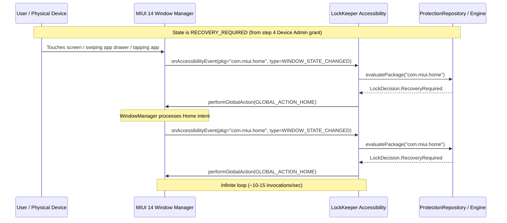

# LockKeeper Critical Incident Response — Agent A3 Android & MIUI Runtime Analysis
**Incident ID:** INCIDENT-2026-09-18-LOCKOUT  
**Target Environment:** Physical Xiaomi Mi 10i (M2007J17I) / Android 12 / MIUI 14 Global (Build SKQ1.211006.001)  
**Investigator:** Agent A3 (Android & MIUI Runtime Specialist)  
**Date:** 2026-09-18  

---

## 1. Executive Summary

This report analyzes the platform-specific interactions between Android 12, MIUI 14, the Android Accessibility framework, Device Policy Manager, and LockKeeper's runtime architecture.

**Key Finding:**  
While the root cause is an internal software defect in state classification (`checkRecoveryStatus`), the specific manifestation—an unbreakable, rapid-fire Home-screen loop that blocked the app drawer, system settings, and power menu—was significantly **amplified by MIUI 14's window dispatch architecture and the recursive feedback loop of `GLOBAL_ACTION_HOME`**.

---

## 2. Platform Behavior vs Software Defect Breakdown

| Factor | Classification | Description & Interaction |
|---|---|---|
| **Triggering `RecoveryRequired` on Admin Grant** | **SOFTWARE DEFECT** | `ProtectionRepository.checkRecoveryStatus()` incorrectly marked `recoveryRequired = true` when `DeviceAdminReceiver.onEnabled()` fired. |
| **Evaluating Launcher as `RecoveryRequired`** | **SOFTWARE DEFECT** | `LockDecisionEngine.evaluate()` evaluated `com.miui.home` as `RecoveryRequired` because Rule 2 preceded any launcher exemption or unprotected app check. |
| **Calling `GLOBAL_ACTION_HOME` on Launcher Events** | **SOFTWARE DEFECT** | `LockKeeperAccessibilityService` invoked `performGlobalAction(GLOBAL_ACTION_HOME)` unconditionally when `com.miui.home` triggered an accessibility event. |
| **MIUI 14 Window Redirection Speed** | **PLATFORM BEHAVIOR** | MIUI's window manager dispatches `GLOBAL_ACTION_HOME` within sub-50ms latency, instantly generating a new `TYPE_WINDOW_STATE_CHANGED` event for `com.miui.home`. |
| **MIUI Power Menu Overlay Interception** | **PLATFORM BEHAVIOR** | On MIUI 14, long-pressing the power button launches `com.miui.powerkeeper` or a `com.android.systemui` dialog. Because LockKeeper intercepts all non-own packages, the power menu was instantly closed by `GLOBAL_ACTION_HOME`. |
| **MIUI Device Admin 10s Countdown** | **PLATFORM BEHAVIOR** | MIUI imposes a 10-second security countdown dialog before allowing Device Admin activation. This forced the user into a prolonged Settings session, during which accessibility services were already listening. |
| **MIUI Aggressive Process Re-binding** | **PLATFORM BEHAVIOR** | MIUI keeps connected AccessibilityServices alive aggressively in the background, ensuring the enforcement loop never died even when LockKeeper's UI was killed. |

---

## 3. Deep Dive: The `GLOBAL_ACTION_HOME` Feedback Cycle

### How Android Accessibility Dispatches Actions
`AccessibilityService.performGlobalAction(GLOBAL_ACTION_HOME)` is a system-level IPC that asks the `WindowManagerService` and `ActivityTaskManagerService` to resolve and launch `Intent(Intent.ACTION_MAIN).addCategory(Intent.CATEGORY_HOME)`.

### The Catastrophic Cycle on MIUI 14


### Why Debouncing Failed to Prevent the Loop
In `LockKeeperAccessibilityService.kt:118`:
```kotlin
// Debounce identical events within 150ms
if (packageName == lastHandledPackage && (now - lastEventTimestamp) < 150L) {
    return
}
```
1. `lastEventTimestamp` was updated at line 121 (`lastEventTimestamp = now`), but `lastHandledPackage` was only updated at line 162 (`lastHandledPackage = packageName`).
2. When `performGlobalAction(GLOBAL_ACTION_HOME)` fired, the window transition to `com.miui.home` often involved intermediate window events from `com.android.systemui` (status bar, navigation bar, wallpaper manager) or MIUI gesture services (`com.miui.home.launcher.overlay`).
3. Alternating packages (`com.android.systemui` <-> `com.miui.home`) **completely bypassed the identical-package debouncer**!
4. Even within `com.miui.home`, window transitions took slightly more than 150ms across the full IPC round-trip, allowing the loop to sustain itself indefinitely.

---

## 4. MIUI 14 Specific Platform Interactions

### 1. The MIUI Launcher (`com.miui.home`)
MIUI 14 replaces the AOSP launcher with `com.miui.home`. Unlike stock AOSP launchers where the app drawer is often an in-process fragment, MIUI uses multiple surface views and floating window helpers. Every swipe gesture emits `TYPE_WINDOW_CONTENT_CHANGED` and `TYPE_WINDOW_STATE_CHANGED` events. Since LockKeeper was listening for both:
```kotlin
// LockKeeperAccessibilityService.kt:63
eventTypes = AccessibilityEvent.TYPE_WINDOW_STATE_CHANGED or
             AccessibilityEvent.TYPE_WINDOW_CONTENT_CHANGED
```
every micro-interaction on the home screen fed the loop with fresh events.

### 2. Device Administrator Activation Flow on MIUI
When LockKeeper requested Device Admin:
- Android displays `com.android.settings.DeviceAdminAdd`.
- MIUI 14 overlays a proprietary warning dialog: `com.miui.securitycenter/com.miui.permcenter.permissions.SystemWarningActivity`.
- This dialog displays a forced 10-second countdown with buttons: "Cancel" (default) and "Next" / "Accept".
- Because the user was navigating this MIUI security flow, when the user tapped "Accept", `LockKeeperDeviceAdminReceiver.onEnabled()` was invoked while the MIUI Security Center was still in the foreground!
- When `onEnabled()` called `notifySecurityStateChanged()`, `checkRecoveryStatus()` turned on `recoveryRequired = true` **while the user was still inside the MIUI Security Center**!
- As soon as the user dismissed the MIUI dialog, the phone attempted to return to LockKeeper or Home, instantly triggering the lock!

### 3. Impact on Hardware Button Interceptions (Power Menu)
On Xiaomi devices with MIUI 14:
- The power menu is rendered by `com.miui.powerkeeper` or `com.android.systemui` as a window dialog with `WindowManager.LayoutParams.TYPE_STATUS_BAR_SUB_PANEL` or `TYPE_APPLICATION_OVERLAY`.
- Accessibility services receive `TYPE_WINDOW_STATE_CHANGED` when this dialog appears.
- Because LockKeeper evaluated all non-LockKeeper packages as `RecoveryRequired` and called `GLOBAL_ACTION_HOME`, the power menu was dismissed the millisecond it appeared.
- The only way to reboot the physical device was a hard hardware reset (holding Power + Volume Down for 12 seconds).

---

## 5. Requirements for Platform-Safe Enforcement

To make LockKeeper resilient across Android 12 and MIUI 14:

1. **Launcher Package Exemption from `GLOBAL_ACTION_HOME`:**
   Under NO circumstances should `performGlobalAction(GLOBAL_ACTION_HOME)` ever be called when the current foreground package IS ALREADY the home launcher!
   Calling `HOME` when you are already at `HOME` is a logic defect that produces self-triggering event storms.
2. **System UI & Power Menu Protection:**
   System UI, power dialogs, and key system surfaces must never be subjected to blind `GLOBAL_ACTION_HOME` redirects unless explicitly attempting to tamper with LockKeeper settings.
3. **Setup State Immunity:**
   During `SETUP_IN_PROGRESS`:
   - All normal packages must be allowed to run uninhibited.
   - LockKeeper must only monitor its own configuration and let the user freely use Android Settings, permission dialogs, and launchers.
4. **Proper Launcher Detection:**
   Dynamically resolve the current default launcher using `PackageManager.resolveActivity(Intent(Intent.ACTION_MAIN).addCategory(Intent.CATEGORY_HOME))` rather than relying on hardcoded package names, ensuring compatibility across MIUI, OneUI, Pixel Launcher, and third-party launchers.

---

## 6. Runtime Analysis Verdict

The physical device lockout was the direct outcome of a software defect operating within an aggressive, high-frequency event environment. By adding launcher immunity, properly isolating `SETUP_IN_PROGRESS`, and preventing recursive global actions, LockKeeper will operate safely across all Android OEM variants.
