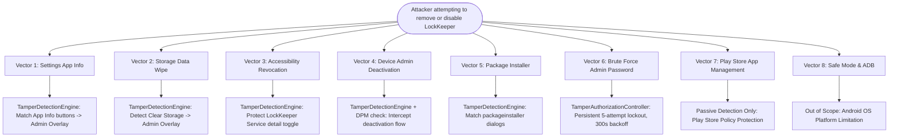

# LockKeeper Self-Protection Threat Model

## 1. Executive Summary & Scope

This document details the threat model, attack vectors, defensive boundaries, and mitigation architecture for LockKeeper's self-protection and anti-tamper capabilities. 

### Security Boundary & Reality Check
LockKeeper operates as a **standard consumer Android application** running with `BIND_ACCESSIBILITY_SERVICE` and standard `DeviceAdminReceiver` capabilities. It is **NOT a Device Owner (DO)** or Profile Owner (PO) enterprise application. 

Under the Android security architecture:
- An ordinary Device Administrator **cannot make uninstallation impossible at the OS kernel or framework level**.
- System-level operations initiated via ADB (`pm uninstall`, `pm clear`) or Android Safe Mode bypass all non-system, non-Device-Owner accessibility services.
- The objective of this implementation is **Maximum Practical UI-Level Anti-Tamper Coverage and Deterrence**: detecting tampering attempts initiated through normal user-facing Android UI and enforcing native Admin Password verification before the action can proceed.

---

## 2. Attacker Personas

| Persona | Motivation | Technical Capability | Typical Vectors Attempted |
|---|---|---|---|
| **P1: Casual User / Teen / Supervised User** | Bypass app limits or locked target apps by removing LockKeeper | Low: Relies on UI discovery, YouTube guides, or friend tips | Launcher long-press, Settings App Info (Uninstall / Force Stop), Google Play Store "Uninstall" button. |
| **P2: Motivated Tamperer** | Systematically disable protection without knowing the Admin Password | Medium: Reads settings, developer options, toggles permissions | Clear Storage/Data, revoking Accessibility permissions, deactivating Device Admin, rapid window swapping, rapid PIN brute-forcing. |
| **P3: Technical Physical Attacker** | Complete removal or state reset with physical access to unlocked device | High: Understands Android framework, developer options, recovery modes | Safe Mode reboot, ADB shell commands, exploiting race conditions, cache clearing. |

---

## 3. Threat Vectors & Attack Paths

### Vector 1: Settings App Info (Uninstall, Force Stop, Disable)
- **Attack Path**: User navigates: `Settings` → `Apps` → `All Apps` → `LockKeeper` → Clicks "Uninstall", "Force Stop", or "Disable".
- **Attacker Goal**: Kill the running process or delete the APK package.
- **Defensive Mechanism**:
  - `TamperDetectionEngine` inspects foreground node hierarchies in `com.android.settings` (or OEM variants).
  - Matches resource IDs (`button1_negative`, `button2_negative`, `entity_header_title`) and semantic action attributes.
  - Fires `TamperType.UNINSTALL` or `TamperType.FORCE_STOP`.
  - `OverlayManager` immediately mounts `AdminOverlayView` bearing `FLAG_SECURE` and distinct LockKeeper branding.
  - The UI is blocked until the LockKeeper Admin Password is verified.

### Vector 2: Storage Clear Data / Storage Wipe
- **Attack Path**: User navigates: `Settings` → `Apps` → `LockKeeper` → `Storage & cache` → Clicks "Clear storage" / "Clear all data".
- **Attacker Goal**: Erase Room SQLite database (`lockkeeper.db`) and `SharedPreferences` (`lockkeeper_prefs.xml`), hoping to reset the app to an unconfigured state where protections are dropped.
- **Defensive Mechanism**:
  - `TamperDetectionEngine` inspects `StorageUseActivity` and resource IDs like `com.android.settings:id/clear_data_button`.
  - Fires `TamperType.CLEAR_DATA`, presenting `AdminOverlayView` before the user can tap the confirmation dialog.
  - **Durable State Protection**: In the event that data is wiped externally, Android KeyStore retains hardware-bound key aliases, and the system identifies that Device Admin is active without configuration, forcing state `SECURITY_RECOVERY_REQUIRED` rather than an insecure fresh start.

### Vector 3: Accessibility Permission Revocation
- **Attack Path**: User navigates: `Settings` → `Accessibility` → `Downloaded apps` → `LockKeeper` → Toggles the master accessibility switch to OFF.
- **Attacker Goal**: Kill the accessibility event stream, which is the primary sensor for App Lock and Anti-Tamper.
- **Defensive Mechanism**:
  - `TamperDetectionEngine` intercepts navigation to `ToggleAccessibilityServicePreferenceFragment` specifically for LockKeeper.
  - Prompts for Admin Password before allowing the deactivation toggle to be flipped.
  - **False Positive Prevention**: General Accessibility Settings (such as `MiuiAccessibilitySettingsActivity` or AOSP `AccessibilitySettings`) are explicitly excluded to prevent trapping the user or reintroducing the physical-device black-screen deadlock.

### Vector 4: Device Administrator Deactivation
- **Attack Path**: User navigates: `Settings` → `Security` → `Device admin apps` → `LockKeeper` → Clicks "Deactivate this device admin app".
- **Attacker Goal**: Strip Device Admin privileges so that third-party uninstallers or standard uninstall flows encounter fewer system barriers.
- **Defensive Mechanism**:
  - `TamperDetectionEngine` inspects `DeviceAdminAdd`.
  - Queries `DevicePolicyManager.isAdminActive(adminComponent)`. If already active, this is classified as a deactivation attempt (`TamperType.DISABLE_DEVICE_ADMIN`) and blocked with the Admin Password overlay.
  - If `isAdminActive == false` (e.g. during initial onboarding), it is recognized as legitimate activation and allowed to pass freely.

### Vector 5: Package Installer & Direct Uninstaller Activities
- **Attack Path**: Triggered by launcher drag-to-uninstall or intent actions `android.intent.action.UNINSTALL_PACKAGE` targeting `package:com.lockkeeper.app`.
- **Attacker Goal**: Complete uninstallation via the system package installer confirmation dialog without opening Settings.
- **Defensive Mechanism**:
  - `TamperDetectionEngine` monitors `com.google.android.packageinstaller`, `com.android.packageinstaller`, and OEM equivalents (`com.miui.packageinstaller`).
  - Traverses the confirmation dialog node hierarchy to verify if the subject app is "LockKeeper".
  - If verified, fires `TamperType.UNINSTALL`, displaying the `AdminOverlayView`.

### Vector 6: Brute-Force Admin Password Attacks
- **Attack Path**: An unauthorized user sitting at the `AdminOverlayView` tries automated or rapid manual guessing of common passwords or patterns.
- **Attacker Goal**: Guess the password to drop the overlay.
- **Defensive Mechanism**:
  - `TamperAuthorizationController` coordinates all verification through native Room DB persistence (`AppSettingsDao`).
  - Persistent failure counter: Maximum 5 failed attempts.
  - Upon 5 failures: 300-second (5-minute) cryptographic wall-clock lockout.
  - Monotonic clock validation (`SystemClock.elapsedRealtime()`) prevents time-skipping within a boot cycle; wall-clock timestamps in Room prevent process-death reset.
  - Constant-time verification prevents side-channel timing leaks.

### Vector 7: Google Play Store App Management
- **Attack Path**: User opens Google Play Store → `Manage apps & device` → `Installed` → `LockKeeper` → Clicks "Uninstall".
- **Defensive Consideration & Policy Constraint**:
  - **Policy Prohibition**: Google Play Developer Program Policies strictly prohibit using Accessibility services to intercept or block users within the Google Play Store or interfering with standard Play Store app management. Doing so results in immediate automated app suspension.
  - **Resolution**: LockKeeper maintains passive monitoring only and **deliberately does not display an intercepting overlay over Google Play Store UI**.

### Vector 8: Safe Mode & ADB Debugging
- **Attack Path**: Attacker boots Android device into Safe Mode (disabling third-party accessibility services and overlays) or connects via USB debugging and issues `adb uninstall com.lockkeeper.app`.
- **Platform Limitation**:
  - Non-system applications lacking Device Owner status cannot block Safe Mode boot or ADB package uninstallation.
  - Documented as an OS-level technical boundary.

---

## 4. Defense-in-Depth Summary

| Layer | Responsibility | Invariant Maintained |
|---|---|---|
| **Layer 1: Sensor & Engine** | `LockKeeperAccessibilityService` + `TamperDetectionEngine` | Bounded traversal (depth 6, max 45 nodes); semantic resource ID matching over fragile English text; no false positives on general settings. |
| **Layer 2: Auth & Rate-Limiting** | `TamperAuthorizationController` + Room DB + Keystore | Max 5 attempts; 300s persistent lockout; 30s monotonic grace window upon success; no plaintext logging. |
| **Layer 3: UI Enforcement** | `OverlayManager` + `AdminOverlayView` | WindowManager `FLAG_SECURE`; TalkBack accessibility labels; clear LockKeeper branding; immediate dismissal when navigating away. |
| **Layer 4: State Machine Integration** | `ProtectionRepository` + `PlatformChannelHandler` | Dynamic security state reflection (`CONFIGURED`, `OPERATIONAL`, `DEGRADED`, `RECOVERY_REQUIRED`); no bypass via Flutter IPC. |
