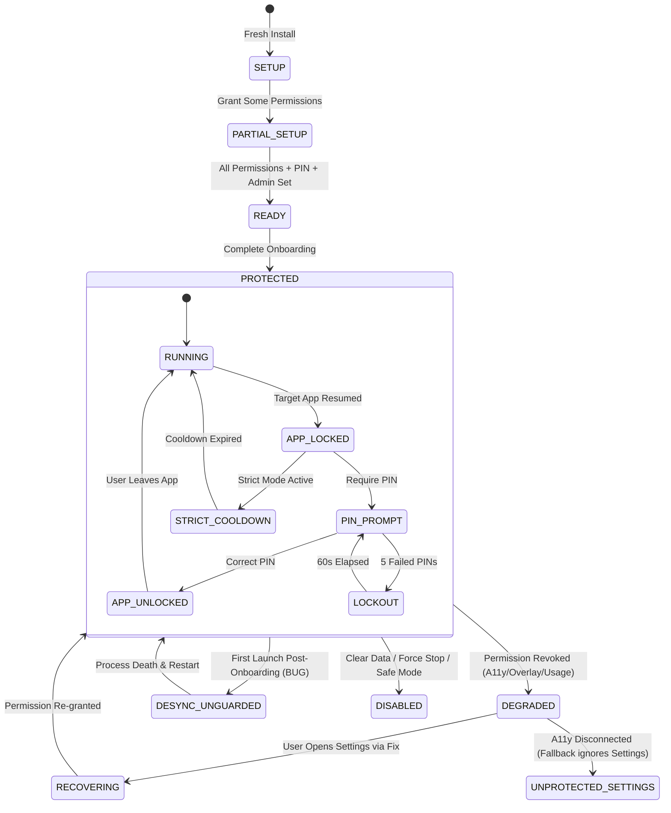

# LockKeeper Source of Truth & Security State Machine Analysis

**Target Repository**: LockKeeper (`C:\AppLocker`)  
**Date**: September 17, 2026  
**Auditor**: Lead Security Architect  

---

## 1. Systemic Source of Truth Analysis

A fundamental source of vulnerabilities in security applications is state desynchronization between disparate layers: operating system state, persistent storage, in-memory caches, native platform handlers, and UI presentation widgets.

Below is the exhaustive audit of all 10 security-critical states across the 10 mandatory dimensions.

---

### Matrix: Security States vs. The 10 Mandatory Architectural Dimensions

| Security State | 1. Authoritative State | 2. Cached Location(s) | 3. Can Cache Become Stale? | 4. Behavior on Process Death | 5. Behavior on Activity Destroy | 6. Behavior on Device Reboot | 7. External OS Change Behavior | 8. Flutter Knowledge | 9. Native Knowledge | 10. Can Layers Disagree? |
|---|---|---|---|---|---|---|---|---|---|---|
| **1. User PIN Configured** | Encrypted blob in SharedPreferences (`lockkeeper_credentials.xml`) | None (Queried via `prefs.contains`) | No | Preserved across process death | Preserved across Activity destroy | Preserved across reboot | Wiped if user clears app storage in Settings | Only via asynchronous `PlatformBridge.hasPin()` | Direct access via `CredentialStore` | Yes, if SharedPreferences read fails or throws exception |
| **2. Admin Password Configured** | Encrypted blob in SharedPreferences (`lockkeeper_credentials.xml`) | None (Queried via `prefs.contains`) | No | Preserved across process death | Preserved across Activity destroy | Preserved across reboot | Wiped if user clears app storage in Settings | Only via asynchronous `PlatformBridge.hasAdminPassword()` | Direct access via `CredentialStore` | Yes, if SharedPreferences read fails or throws exception |
| **3. Accessibility Enabled in OS** | `Settings.Secure.ENABLED_ACCESSIBILITY_SERVICES` in Android System | Checked in `PlatformChannelHandler` line 245 | **YES** | OS holds truth; native evaluates on demand | Preserved | Preserved across reboot | OS changes reflected on next poll | Asynchronous poll via `getProtectionStatus()` | Querying `Settings.Secure` | **YES**: If package string remains in `enabled_accessibility_services` after crash, reported as granted. |
| **4. Accessibility Service Connected** | Android OS Binder connection in `AccessibilityManagerService` | `LockKeeperAccessibilityService.isConnected` (`@Volatile static`) | **YES** | Reset to `false` until system binds | Preserved (service runs independently) | `false` during boot until system re-binds | If OS unbinds or crashes service, field remains `false` | Flutter does not distinguish connected vs granted! | Checked via `isConnected` static field | **YES**: Flutter treats `isAccessibilityGranted` as true even when `isConnected == false`! |
| **5. Device Administrator Active** | Android OS `DevicePolicyManager.isAdminActive()` | None (Queried on demand in `PlatformChannelHandler`) | No | Preserved in OS | Preserved | Preserved across reboot | User deactivation reflected immediately on next call | Asynchronous poll via `getProtectionStatus()` | Direct via `dpm.isAdminActive()` | No |
| **6. Overlay Permission** | Android OS `Settings.canDrawOverlays(context)` | None (Queried on demand via `Settings.canDrawOverlays`) | No | Preserved in OS | Preserved | Preserved across reboot | Reflected immediately on next call | Asynchronous poll via `getProtectionStatus()` | Direct via `Settings.canDrawOverlays` | No |
| **7. Usage Stats Permission** | Android OS `AppOpsManager.unsafeCheckOpNoThrow` | None (Queried on demand via `AppOpsManager`) | No | Preserved in OS | Preserved | Preserved across reboot | Reflected immediately on next call | Asynchronous poll via `getProtectionStatus()` | Direct via `AppOpsManager` | No |
| **8. Onboarding Completed** | Room SQLite `app_settings.onboardingComplete` | 1. SharedPreferences `lockkeeper_protection_prefs` 2. Flutter `LockKeeperApp.widget.isOnboardingComplete` | **YES (CRITICAL)** | Room & Prefs preserved; Flutter memory reset | Flutter memory retained | Room & Prefs preserved | Reset if storage cleared | **NO (STALE)**: Stays `false` in widget tree on first run! | Direct via Room & Prefs | **YES**: Flutter root is `false` while Native Room & Prefs are `true`! |
| **9. App Lock Enabled (Per-App)** | Room SQLite `locked_apps` table | In-memory `activeSessions` in `LockDecisionEngine` | **YES** | Database preserved; in-memory sessions cleared | Preserved | Preserved; sessions cleared | Target app uninstalled outside LockKeeper leaves orphan DB row | Flutter loads snapshot via `getLockedApps()` | Reactive via Room queries | **YES**: Active session in memory overrides `isLocked=true` in DB indefinitely. |
| **10. Self-Lock Active** | Room SQLite `app_settings.selfLockEnabled` | In-memory `SelfLockSessionManager.isSessionActive` | **YES** | Database preserved; session reset to `false` | Preserved | Preserved; session reset to `false` | None | Flutter tracks `_isLocked` in `_LockKeeperAppState` | Evaluated in `ProtectionRepository` | **YES**: If Flutter catch block triggers, Flutter sets `_isLocked=false` regardless of backend truth! |

---

## 2. The LockKeeper Security State Machine

---

## 3. Analysis of Invalid State Transitions & Fault Modes

### Fault Mode 1: The First-Launch Desynchronization State (`DESYNC_UNGUARDED`)
- **Valid Transition**: `READY` -> `PROTECTED` (where self-lock immediately guards the application).
- **Actual Code Transition**:
  When `OnboardingScreen` calls `setOnboardingComplete(true)`, native Room and SharedPreferences update to `true`.
  However, Flutter's root `LockKeeperApp` was passed `isOnboardingComplete: false` at application boot.
  Because Flutter navigation uses `Navigator.pushReplacement(HomeScreen)`, the root widget is not recreated.
  The state machine enters an undocumented, insecure state: `DESYNC_UNGUARDED`, where:
  - Background lifecycle events are dropped (`if (!widget.isOnboardingComplete) return;`).
  - The self-lock gate is never rendered (`if (!widget.isOnboardingComplete) return child!;`).
  - The system remains in this unauthenticated state until Android OS kills the process.

### Fault Mode 2: The Service Dead / Permission Granted Discrepancy
- **Valid Transition**: `PROTECTED` -> `DEGRADED` (when accessibility service stops).
- **Actual Code Transition**:
  In `PlatformChannelHandler.kt` line 249:
  `isAccessibilityGranted = isServiceConnected || enabledServices.contains(context.packageName)`
  If the Android OS stops `LockKeeperAccessibilityService` due to memory pressure or a crash:
  - `isServiceConnected` is `false`.
  - `enabledServices.contains(...)` is `true`.
  - `getProtectionStatus()` reports `isAccessibilityGranted = true`.
  - The UI degradation banner displays green "Active" status.
  - In reality, accessibility window monitoring is DEAD, and `LockKeeperForegroundService` is running its battery-draining 400ms polling loop without settings protection!

### Fault Mode 3: The Multi-Digit PIN Lockout Dead End
- **Valid Transition**: `PIN_PROMPT` -> `APP_UNLOCKED` (on entering correct 5–8 digit PIN).
- **Actual Code Transition**:
  In `SelfLockGateScreen.dart`, the keypad handler transitions to `_submitPin()` unconditionally when `_pinBuffer.length >= 4`.
  If the target PIN length is 6, the state machine transitions to `PIN_FAILED` on the 4th keypress without ever reaching the valid credential input state.
  After 5 attempts, it enters `LOCKOUT`. Once lockout expires, the cycle repeats indefinitely.
  This represents an inescapable terminal failure state for legitimate users with multi-digit PINs.
