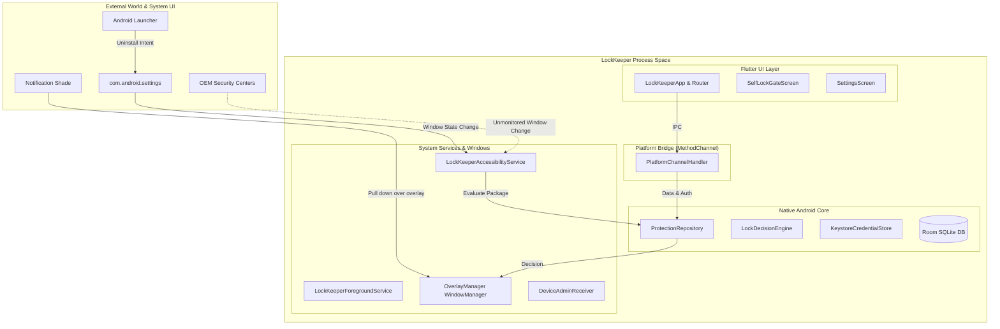

# LockKeeper Threat Model

**Application**: LockKeeper (`com.lockkeeper.app`)  
**Architecture**: Flutter 3.x + Native Kotlin Android (Room SQLite, AccessibilityService, Device Administrator, WindowManager Overlay)  
**Date**: September 17, 2026  
**Auditor**: Lead Security & Software Quality Auditor  

---

## 1. System Characterization & Assets

LockKeeper is designed to enforce friction and access control over third-party Android applications selected by the device user, and to protect its own operational integrity against impulsive or unauthorized deactivation and removal.

### Primary Assets:
1. **Target Application Access Control**: Restricting launch of protected apps until authenticated via PIN or until strict cooldown expires.
2. **User PIN**: 4–8 numeric digit daily authentication credential.
3. **Admin Password**: Alphanumeric master credential guarding configuration changes, uninstallation, and permission revocation.
4. **Protection Configuration**: Room SQLite records of locked apps, strict cooldown timestamps, and failed attempt lockout status.
5. **Anti-Tamper & Anti-Removal Boundaries**: Deterrence mechanisms preventing uninstallation, service termination, or storage clearing.

---

## 2. Threat Actors & Capabilities

| Threat Actor | Access Level | Capabilities | Motivation |
|---|---|---|---|
| **TA-1: Device Possessor (Self-User)** | Full Physical Access | Physical touch, standard settings navigation, launcher interactions, rebooting, safe mode. No ADB or PC access. | Bypassing focus friction or strict cooldown timers to access distracting apps. |
| **TA-2: Casual Physical Attacker (Borrower/Thief)** | Full Physical Access | Device is unlocked or screen unlocked. Can browse settings, notifications, launcher. | Accessing protected private applications (WhatsApp, Banking, Gallery) without PIN. |
| **TA-3: Technical Physical Attacker** | Physical + External Controls | Can boot device to recovery/safe mode, alter system language, manipulate SIM/network, use developer shortcuts. | Removing LockKeeper without knowing Admin Password. |
| **TA-4: Malicious Co-Located App** | Unprivileged Android App | Running in background on same device. Can request `SYSTEM_ALERT_WINDOW`, `PACKAGE_USAGE_STATS`, or record screen. | Exfiltrating PIN/password or racing overlay windows. |

---

## 3. Trust Boundaries & Attack Surfaces

---

## 4. Threat Matrix & Attack Paths

### Attack Path 1: Language-Shift Anti-Tamper Bypass (CRITICAL)
- **Actor**: TA-1, TA-2, TA-3
- **Preconditions**: Phone unlocked, LockKeeper active with Admin Password set.
- **Attack Path**:
  1. Open Android Settings -> System -> Languages.
  2. Switch device language to Spanish (or any non-English locale).
  3. Open Settings -> Apps -> LockKeeper.
  4. Accessibility Service receives `TYPE_WINDOW_STATE_CHANGED`.
  5. `searchNodeForText` checks for English strings: `"uninstall"`, `"force stop"`, `"storage & cache"`.
  6. The Spanish screen displays `"Desinstalar"`, `"Forzar detención"`, `"Almacenamiento"`.
  7. The check returns `false`; `isSensitiveScreen` is `false`.
  8. `AdminOverlayView` is never shown.
  9. Attacker taps `"Desinstalar"` or `"Almacenamiento"` -> `"Borrar datos"`.
- **Impact**: Total compromise of protection; LockKeeper is uninstalled or cleared without Admin Password.

### Attack Path 2: Launcher Drag-to-Uninstall Bypass (CRITICAL)
- **Actor**: TA-1, TA-2
- **Preconditions**: Third-party or stock launcher supporting drag-to-uninstall.
- **Attack Path**:
  1. From Home launcher, long-press LockKeeper icon.
  2. Drag to "Uninstall" bin or tap popup "Uninstall".
  3. System launches `com.google.android.packageinstaller.PackageInstallerActivity`.
  4. `LockKeeperAccessibilityService` ignores package because `packageName != "com.android.settings"`.
  5. If Device Admin prompt appears, tapping "Manage device admins" routes directly to deactivation prompt.
  6. Admin is deactivated and app is uninstalled.
- **Impact**: Uninstallation with zero Admin Password friction.

### Attack Path 3: Multi-Digit PIN Lockout Trap (Denial of Service) (CRITICAL)
- **Actor**: Legitimate User / Accidental self-lockout
- **Preconditions**: User sets a 5, 6, 7, or 8-digit PIN during onboarding.
- **Attack Path**:
  1. App locks; `SelfLockGateScreen` renders.
  2. User enters digits 1, 2, 3, 4.
  3. `SelfLockGateScreen.dart` line 92 triggers auto-submit immediately at length 4.
  4. Keystrokes for remaining digits are ignored.
  5. Native verification fails; failed attempt counter increments.
  6. After 5 attempts, user is locked out for 60 seconds. User can never authenticate into app UI.
- **Impact**: Permanent loss of UI access for legitimate user.

### Attack Path 4: First-Launch Desynchronization Bypass (HIGH)
- **Actor**: TA-2 (Physical intruder)
- **Preconditions**: Device owner finishes initial onboarding setup.
- **Attack Path**:
  1. Device owner finishes onboarding and hands phone to another person or leaves it unattended.
  2. `LockKeeperApp` was created with `isOnboardingComplete = false`.
  3. Onboarding screen pushed `HomeScreen` without rebuilding root `LockKeeperApp`.
  4. Intruder opens LockKeeper.
  5. Self-lock gate is never rendered because `widget.isOnboardingComplete` is still `false`.
  6. Intruder browses all settings and disables locking on any app.
- **Impact**: Unauthorized configuration tampering.

### Attack Path 5: Unthrottled Settings PIN Recovery (HIGH)
- **Actor**: TA-1, TA-2
- **Preconditions**: Physical access to LockKeeper settings.
- **Attack Path**:
  1. Open LockKeeper -> Settings -> "Change User PIN".
  2. Dialog prompts for "Current PIN".
  3. `PlatformChannelHandler.verifyPin` does not increment failed attempt counter or check lockout.
  4. Attacker inputs numeric guesses (`0000`–`9999`).
  5. Cracks 4-digit PIN in minutes.
- **Impact**: Complete compromise of daily User PIN.

### Attack Path 6: Screen Recording Overlay Credential Theft (HIGH)
- **Actor**: TA-4 (Malicious app or background recorder)
- **Preconditions**: Device running screen recording or mirroring.
- **Attack Path**:
  1. User opens a locked app; `PinOverlayView` is displayed.
  2. Overlay window was created by `OverlayManager.createLayoutParams()` without `FLAG_SECURE`.
  3. Screen capture frames record the user's PIN keypad taps.
- **Impact**: Plaintext recovery of user credentials.

---

## 5. Security Boundary Summary

| Boundary | Intended Assumption | Real System Behavior | Strength |
|---|---|---|---|
| **App Lock Enforcement** | Accessibility detects app launch and blocks screen immediately. | 150ms debounce and IPC latency create a 100–300ms window where target app is visible. | WEAK |
| **Settings Anti-Tamper** | Accessibility intercepts deactivation and uninstall attempts. | Easily bypassed via non-English languages, OEM security apps, and Launcher package installers. | BROKEN |
| **Uninstall Protection** | Device Administrator prevents uninstallation. | Device Admin only displays a warning; deactivation cannot be blocked without Device Owner. | ILLUSORY |
| **Credential Encryption** | Credentials encrypted in AndroidKeyStore. | Strong hardware-backed encryption, but vulnerable to permanent lockout if cloud-backed up. | STRONG (Local) / FRAGILE (Restore) |
| **Self-Lock Protection** | LockKeeper requires PIN every time it is opened. | Bypassed on first run after onboarding due to Flutter root desynchronization; auto-submit breaks 5-8 digit PINs. | BROKEN |
