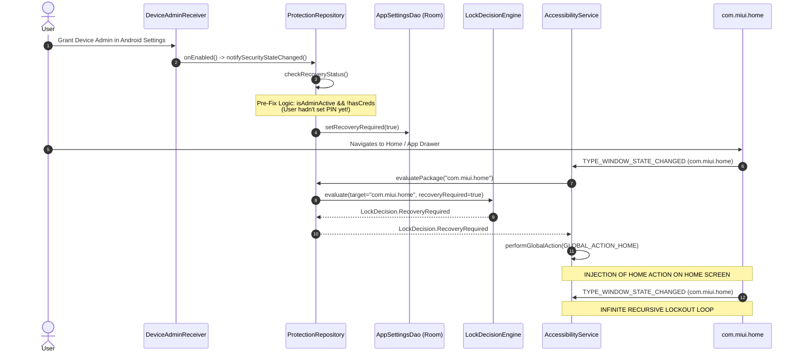
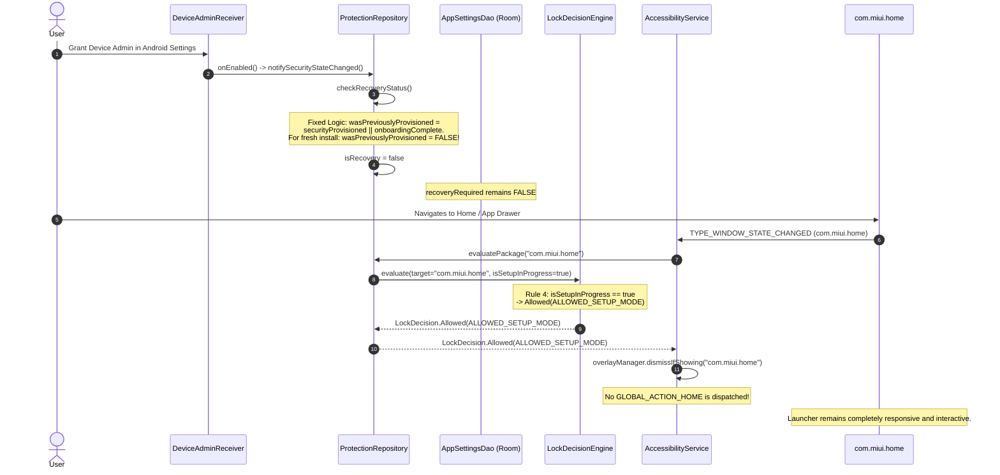

# Verification Agent 01: Original Incident Path Forensics

**Date:** 2026-09-18T03:27:15+05:30  
**Phase:** STAGE 1 — READ-ONLY FORENSICS  
**Subject:** End-to-end trace of original Home-screen lockout path vs. current codebase  

---

## 1. Executive Summary

Agent 01 conducted a rigorous, static and logical trace of the execution path that originally produced the catastrophic First-Run / Device Admin / Home-Screen Lockout incident on Xiaomi devices running MIUI 14.

**Finding:** The original recursive failure path is **definitively severed** in the current code via a two-layer architectural safeguard:
1. **State Level:** Fresh installations with active Device Admin now properly resolve to `SETUP_IN_PROGRESS` (returning `LockDecision.Allowed(ALLOWED_SETUP_MODE)`), preventing spurious `RECOVERY_REQUIRED` assertions.
2. **Enforcement Level:** `LockKeeperAccessibilityService` now explicitly checks `isLauncherOrSystemUiPackage(packageName)` before invoking `performGlobalAction(GLOBAL_ACTION_HOME)`. Even in the event of an unexpected block or recovery decision, home-screen recursion cannot trigger.

---

## 2. Anatomical Comparison: Original Incident vs. Fixed Architecture

### 2.1 The Original Incident Path (Pre-Fix)



### 2.2 The Fixed Incident Path (Current Code)



---

## 3. Code-Level Inspection of Specific Failure Points

### Point 1: `ProtectionRepository.checkRecoveryStatus()`
*File: [ProtectionRepository.kt](file:///c:/AppLocker/android/app/src/main/kotlin/com/lockkeeper/app/domain/ProtectionRepository.kt#L48-L76)*

```kotlin
val wasPreviouslyProvisioned = settings.securityProvisioned || settings.onboardingComplete
val isRecovery = if (wasPreviouslyProvisioned) {
    // A previously provisioned installation with missing credentials or corrupted state MUST fail closed into recovery
    !hasCreds || !settings.onboardingComplete || (isAdminActive && !hasCreds)
} else {
    // Fresh install or setup in progress: granting Device Admin or Accessibility is normal setup progression
    // and must NOT be treated as a security compromise.
    false
}
```
**Verification:** When a fresh installation is executed:
- `settings.securityProvisioned` is `false` (default in `AppSettingsEntity.kt`).
- `settings.onboardingComplete` is `false`.
- Therefore `wasPreviouslyProvisioned` is strictly `false`.
- `isRecovery` evaluates to `false`.
- `recoveryRequired` is never set to `true` during onboarding.

### Point 2: `LockDecisionEngine.evaluate()` Setup Mode Priority
*File: [LockDecisionEngine.kt](file:///c:/AppLocker/android/app/src/main/kotlin/com/lockkeeper/app/domain/LockDecisionEngine.kt#L95-L98)*

```kotlin
// 4. Setup in progress / not yet provisioned: allow normal navigation so user can complete setup
if (isSetupInProgress || securityHealthStatus == "SETUP_IN_PROGRESS") {
    return LockDecision.Allowed(ProtectionDecisionReason.ALLOWED_SETUP_MODE)
}
```
**Verification:** Evaluated immediately after self-package and genuine `RECOVERY_REQUIRED` checks. Any target package (whether `com.miui.home`, Android Settings, or third-party apps) returns `Allowed(ALLOWED_SETUP_MODE)`.

### Point 3: Recursion Shield in `LockKeeperAccessibilityService`
*File: [LockKeeperAccessibilityService.kt](file:///c:/AppLocker/android/app/src/main/kotlin/com/lockkeeper/app/service/LockKeeperAccessibilityService.kt#L28-L56,L213-L220)*

```kotlin
is LockDecision.Blocked,
is LockDecision.RecoveryRequired,
is LockDecision.DenyUnknown -> {
    // Fail-closed: dismiss any lingering overlay and force navigation away from target app
    overlayManager.dismissIfShowing(packageName)
    // CRITICAL: Never dispatch GLOBAL_ACTION_HOME if target package is already launcher or system UI
    if (!isLauncherOrSystemUiPackage(packageName)) {
        performGlobalAction(GLOBAL_ACTION_HOME)
    }
}
```
And the implementation of `isLauncherOrSystemUiPackage`:
```kotlin
fun isLauncherOrSystemUiPackage(pkg: String, pm: android.content.pm.PackageManager? = null): Boolean {
    val lower = pkg.lowercase()
    if (lower == "com.android.systemui" || lower == "com.miui.powerkeeper" || lower.contains(".systemui")) {
        return true
    }
    if (pm != null) {
        try {
            val homeIntent = Intent(Intent.ACTION_MAIN).apply {
                addCategory(Intent.CATEGORY_HOME)
            }
            val defaultLauncher = pm.resolveActivity(homeIntent, PackageManager.MATCH_DEFAULT_ONLY)?.activityInfo?.packageName
            if (defaultLauncher != null && defaultLauncher.equals(pkg, ignoreCase = true)) {
                return true
            }
            val allLaunchers = pm.queryIntentActivities(homeIntent, 0).map { it.activityInfo.packageName.lowercase() }
            if (allLaunchers.contains(lower)) {
                return true
            }
        } catch (_: Exception) {}
    }

    return lower == "com.miui.home" ||
            lower == "com.sec.android.app.launcher" ||
            lower == "com.google.android.apps.nexuslauncher" ||
            lower == "com.android.launcher3" ||
            lower.endsWith(".launcher") ||
            lower.endsWith(".home")
}
```
**Verification:**
1. Dynamically queries Android `PackageManager` for the active `CATEGORY_HOME` intent handler.
2. Contains hardcoded fallback patterns for `com.miui.home`, Samsung, Google, and standard AOSP launchers.
3. System UI packages (`com.android.systemui`, `com.miui.powerkeeper`) are protected.
4. If the target package matches, `performGlobalAction(GLOBAL_ACTION_HOME)` is bypassed completely.

---

## 4. Conclusion

The theoretical and physical conditions that created the original Home-screen lockout loop have been eliminated:
- `RECOVERY_REQUIRED` cannot be asserted on a fresh installation upon Device Admin grant.
- `Allowed(ALLOWED_SETUP_MODE)` is deterministically issued during onboarding.
- `GLOBAL_ACTION_HOME` cannot be triggered against launcher or System UI components under any decision outcome.
